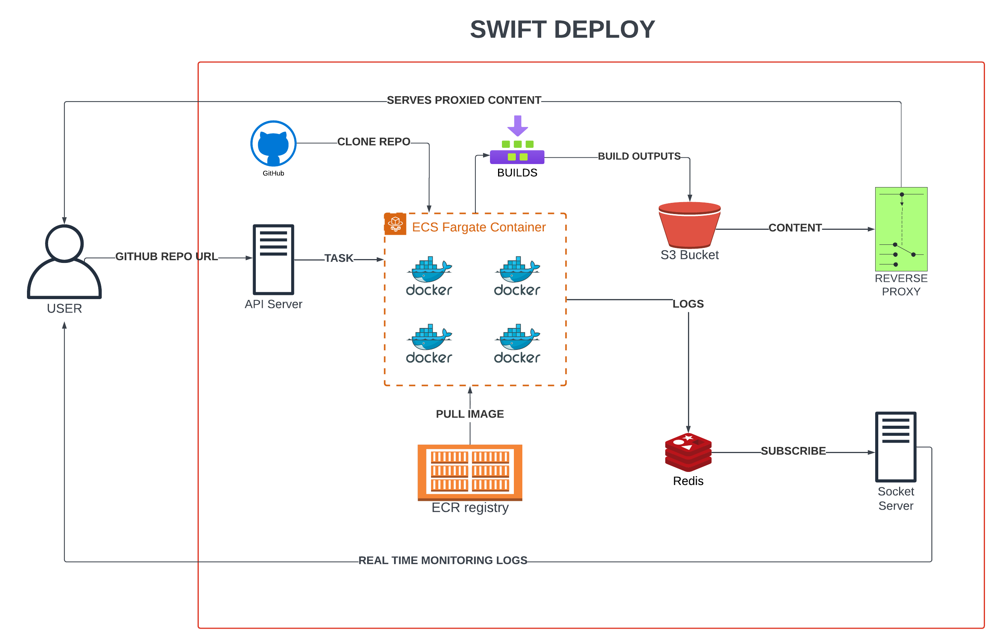

# Swift Deploy

## Overview

Swift Deploy is a comprehensive deployment solution that automates the build, deployment, and delivery of static assets. It supports deploying static sites directly from a GitHub URL and features real-time log streaming and a reverse proxy to serve static content from an S3 bucket.

## Components

This project contains the following services and folders:

- **`api-server`**: HTTP API Server for REST APIs to initiate deployment process.
- **`socket-server`**: Handles real-time log streaming to the frontend.
- **`build-server`**: Builds Docker images, clones repositories, and pushes builds to S3.
- **`s3-reverse-proxy`**: Reverse proxies subdomains and domains to serve static assets from an S3 bucket.

## Services Used

- **Node.js**: Used for running the server-side scripts and managing real-time communication.
- **Express**: Powers the HTTP API server that handles deployment requests.
- **Socket.IO**: Streams real-time logs from the build server to the frontend.
- **Docker**: Packages the build and deployment processes into containers for consistency and scalability.
- **AWS S3**: Stores and serves the static assets produced by the build server.
- **Redis**: Manages real-time messaging and caching for build status updates.
- **http-proxy**: Routes requests to the correct S3 bucket paths for serving static content.
- **AWS ECS**: Orchestrates and manages Docker containers used in the build and deployment process.
- **AWS ECR**: Stores Docker images used by the ECS tasks for building and deploying applications.

## Architecture

